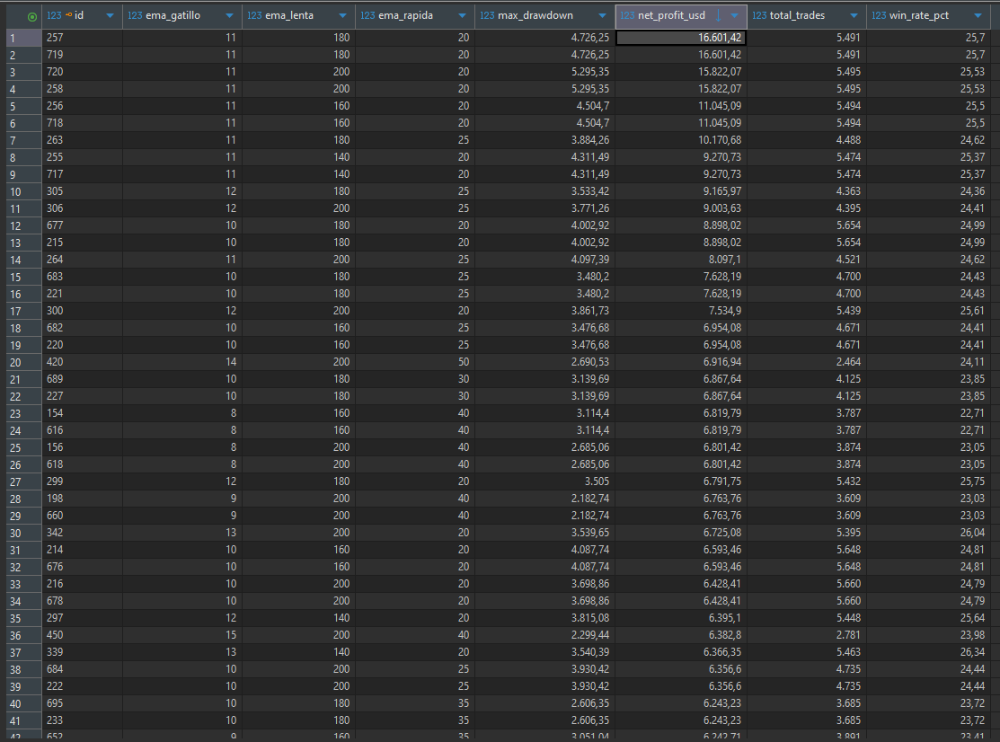

zEngine FrameWork de Trading

Professional High-Performance Trading Backtest & Optimization Framework

zEngine es un framework de investigación cuantitativa desarrollado en Java 21+ y Spring Boot 4. A diferencia de los bots de trading convencionales, zEngine no busca el "mejor resultado puntual", sino la Meseta de Robustez: zonas de parámetros donde la estrategia sobrevive a diferentes ciclos de mercado sin caer en el overfitting (sobre-optimización).

Objetivo del Proyecto
El fin de este framework es proporcionar una herramienta científica para el desarrollo de estrategias. Permite:

Fuerza Bruta Masiva: Probar miles de combinaciones de parámetros en segundos.

Validación de Robustez: Identificar si una estrategia es sólida o si su éxito es solo producto del azar.

Gestión de Riesgo Real: Simulación de capital con Position Sizing Dinámico (Riesgo porcentual fijo) e interés compuesto.

Arquitectura y Estándares 
Este proyecto ha sido construido bajo estándares de ingeniería de software de nivel Senior, cumpliendo con los siguientes principios:

SOLID Principles:

Open/Closed: El motor está cerrado a la modificación pero abierto a la extensión (puedes añadir nuevas estrategias sin tocar el core).

Interface Segregation: El motor solo conoce la interfaz TradingStrategy, no la implementación.

Clean Architecture: Separación clara entre el núcleo de negocio (core), el motor de ejecución (engine) y la capa de persistencia (model/repository).

Design Patterns: Uso de Strategy Pattern para los algoritmos de trading y Orchestrator Pattern para la ejecución de tareas complejas.

High Performance: Procesamiento de archivos CSV masivos en memoria RAM con complejidad O(n) para garantizar velocidad institucional.

Configuración de Ejemplo (Trend Following)
El framework viene pre-configurado en el paquete examples con la TripleEmaStrategy. Esta estrategia utiliza una jerarquía de temporalidades para filtrar el ruido del mercado:

EMA Gatillo (1h): Disparador de entrada/salida.

EMA Rápida (4h): Contexto de tendencia inmediata.

EMA Lenta (12h): Filtro de tendencia mayor (Institucional).

Gestión de Riesgo configurada:

Riesgo por Operación: 1.5% del capital actual.

Salida: Dinámica por cruce de indicadores (Corte rápido de pérdidas, dejar correr ganancias).

Datos Históricos (/historical_data)
El repositorio incluye una carpeta de datos con archivos CSV reales de Bitcoin (BTC/USDT).

Estructura: Los archivos siguen el formato estándar de Binance (Timestamp, Open, High, Low, Close, Volume).

Carga Masiva: El MarketDataProvider está diseñado para leer todos los archivos de la carpeta automáticamente y ordenarlos cronológicamente antes de iniciar la simulación.

Cómo empezar
Requisitos: Java 17+, Maven 3.6+ y PostgreSQL.

Base de Datos: Crea una base de datos en Postgres llamada zengine_db.

Configuración: Ajusta tus credenciales en src/main/resources/application.properties.

Ejecución: ```bash
mvn clean install
mvn spring-boot:run

Análisis: Una vez finalizado, abre tu herramienta SQL preferida (pgAdmin) y exporta la tabla optimization_results a un CSV para analizar la meseta de robustez en Excel o Python.

🛠️ Escalabilidad
zEngine es una base "Vanilla" lista para escalar:

Integración con APIs de Brokers (Binance, Alpaca).

Implementación de modelos de Machine Learning como estrategias.

